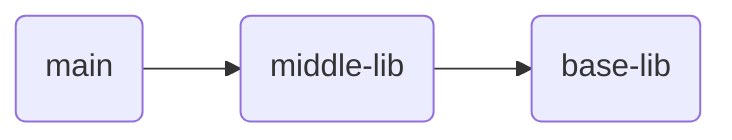
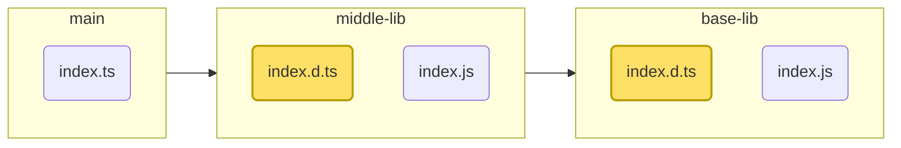
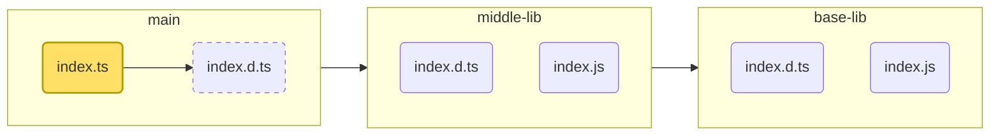
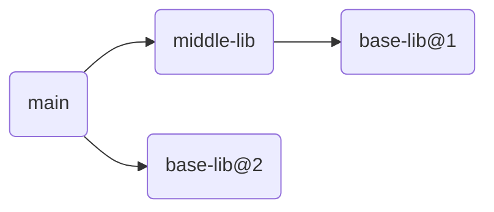

# 推論された型の移植性エラー<br>`TS2742`に挑む

TSKaigi 2025 LT @elecdeer

<style>
  code {
    /* --uno: 'bg-slate-900 !'; */
    /* background-color: var(--) */

    /* @apply bg-slate-900; */

    --neversink-fg-code-color:rgb(255, 255, 255);
    --neversink-bg-code-color:rgb(26, 26, 43);
  }
</style>

<!--
推論された型の移植性エラーTS2742に挑むというテーマで発表させていただきます
-->

---
layout: side-title
titlewidth: is-4-8
align: cm-cm
---

:: title ::

<div class="flex justify-center items-center">
   
</div>

:: content ::

<div class="text-4xl my-8">elecdeer</div>

<div class="flex flex-col items-center gap-2 my-8">
  <div>
    <simple-icons-x /> @elecdeerdev
  </div>
  <div>
    <simple-icons-github /> @elecdeer
  </div>
</div>

<div class="my-8">
チームラボ フロントエンド班
</div>

<!--
00:30

elecdeerと言います

会場から5分くらいの所にあるチームラボという会社でフロントエンドエンジニアをやっています
-->

---
layout: section
align: center
class: bg-tlb-yellow
---

# TS2742エラー見たことありますか？

<!--
突然ですが、皆さんはこのエラー知ってますか？
-->

---


> `The inferred type of 'returnValue' cannot be named without a reference to ''../../middle-lib/node_modules/base-lib/dist/index.js'. This is likely not portable. A type annotation is necessary. ts(2742)`

> `'returnValue' の推論された型には、'../../middle-lib/node_modules/base-lib/dist/index.js' への参照なしで名前を付けることはできません。これは、移植性がない可能性があります。型の注釈が必要です。ts(2742)`

<div class="text-4xl text-center my-4">?</div>

<!--
具体的にはこういうエラーです。

これは移植性のない可能性があります。
型の注釈が必要です。
というTypeScriptヨクワカラナイエラーの一つです。
-->

---

# 実際の開発で見た例

`SomeComponent.stories.tsx`で発生

-> `'meta'の推論された型には、'.pnpm/csstype@3.1.3/node_modules/csstype'への参照なしで名前を付けることはできません。`

<!--
これは決して幻のエラーではなく、実際の開発で遭遇して困ったことがあります。
StorybookのStoryを書いていたらcsstypeへの参照で発生しました。
-->

---
layout: section
align: center
class: bg-tlb-yellow
---

# どういうエラーなのか？

<!--
1:30位

ここからはこれがどういうエラーなのかを説明していきます。
-->

---

# このエラーは何なのか

TypeScriptがd.tsファイルを生成する際に、**間接的に参照される型**を解決できない場合に発生する。

https://github.com/microsoft/TypeScript/pull/58176#issuecomment-2052698294
が詳しい。


<!--
端的にいうと、TypeScriptがd.tsファイルを生成しようとする際に、間接的に参照されるモジュールの型を解決できない場合に発生します。

キャバノー先生のこのissueが詳しいです。
-->

---

# tscのd.ts出力を考える

パッケージの依存関係は以下のようになっているとする。



**mainはbase-libには直接依存していない。** いわゆる推移的依存関係（transitive dependency）

<!--
例として以下のような依存関係のパッケージを考えます
-->

<!--
例を見ながら説明していきます。

main, middle-lib, base-libの3つのライブラリがあって、こんな感じに依存しているとします。

ポイントは、mainはbase-libに直接依存してなく、middle-libを介して間接的に依存しているということです。
-->

---
class: codeblock-large
---

# base-libとmiddle-libのd.ts

### base-lib/index.d.ts

```ts
export type SomeComplexType = {
  // （中身は余り関係無いが、単純すぎるとインライン化されるみたい）
  num: number;
  nest?: SomeComplexType;
};
export declare const returnsInferredSomeComplexType: () => SomeComplexType;
```

<br>

### middle-lib/index.d.ts

<!-- prettier-ignore -->
```ts
export declare const wrappedReturnsInferredSomeComplexType: 
  () => import("base-lib").SomeComplexType;
```

`base-lib`に依存している



<!--
base-libとmiddle-libの中身はこんな感じになっています。

コンパイル後のファイルだけ出しますが、base-libは単にSomeComplexType型とその型を返す関数をexportしています。

middle-libはその関数を呼び出す別の関数をexportしています。
みてのとおり、middle-libはbase-libの型をimportしています。
-->

---
class: codeblock-large
---

# mainパッケージでの問題

mainパッケージで以下の様なコードを書いたとする。

```ts
import { wrappedReturnsInferredSomeComplexType } from "middle-lib";

export const mainValue = wrappedReturnsInferredSomeComplexType();
//             ^| base-libの型SomeComplexTypeに推論されるが...
```

このコードをコンパイルしたとき、d.tsはどのように出力すべきか？

```ts
import { wrappedReturnsInferredSomeComplexType } from "middle-lib";

export const mainValue: ???;
```

<div class="my-16" />



<!--
ようやく本題ですが、mainパッケージでこのようなコードを書いたときのコトを考えます。

middle-libからexportされている関数を呼び出して、その返値を変数mainValueに入れています。
型注釈は書いていないので、mainValueの型はSomeComplexTypeに推論されます。

（SomeComplexTypeはbase-libの型なので、暗黙的に依存しているといえます。）

このコードをtscした時、d.tsはどのように出力されるべきでしょうか？
-->

---
class: codeblock-large
---

# ダメな例

### mainパッケージ基準の相対パスで指定

<!-- prettier-ignore -->
```ts
import { getBaseLibValue } from "middle-lib";
import type { SomeComplexType } from 
  "../node_modules/middle-lib/node_modules/base-lib/index.js";

export const mainValue: SomeComplexType;
```

<div class="my-8" />

### middle-libの内部ディレクトリを参照

```ts
import { getBaseLibValue } from "middle-lib";
import type { SomeComplexType } from "middle-lib/node_modules/base-lib/index.js";

export const mainValue: SomeComplexType;
```

<div class="my-8" />

-> node_modulesの構造はパッケージマネージャによって異なるのでNG

大まかには、hoistingするかどうかで変わる

<!--
考えてみると簡単ではないことが分かります。

ダメな例として、mainパッケージ基準の相対パスでimportすることや、middle-libの内部ディレクトリを参照することがあります。

これらはtscの出力としては上手くいきません。
npm installとかした時のディレクトリ構造はパッケージマネージャによって違うためです。
-->

---
class: codeblock-large
---

# これは...?

```ts
import { getBaseLibValue } from "middle-lib";
import type { SomeComplexType } from "base-lib";

export const mainValue: SomeComplexType;
```

一見よさそうに見えるが、middle-lib --> base-libとmain --> base-libの指す先が同じとは限らない

別のバージョンに依存していた場合は、実装と型が乖離して壊れる可能性がある



```ts
import { wrappedReturnsInferredSomeComplexType } from "middle-lib";
import type { SomeComplexType } from "???"; // 無理！！！
export const mainValue: ???; // 無理！！！
```

-> **移植性がない**として`TS2742`エラーを発生させる

<!--
2:30位？

このようにbase-libをimportする形にすると一見良さそうに見えますが、これもだめです。
図のように、base-libへの他の依存があった場合に上手くいきません。

こんな感じで、tscは有効な型定義を書くことができないときに、両手を挙げてTS2742エラーを出します。
-->

---
layout: section
align: center
class: bg-tlb-yellow
---

# どうするべきなのか

<!--
ここまでで、TS2742エラーがどういうエラーなのかを見ていきましたが、ここからは解決編です。
-->

---
class: codeblock-large
---

# ユーザ側（main）の対策

## エラーの言うとおり、型注釈を明示的に書く

>... 型の注釈が必要です。ts(2742)
```ts
import { wrappedReturnsInferredSomeComplexType } from "ref";

export const returnValue: ReturnType<
  typeof wrappedReturnsInferredSomeComplexType
> = wrappedReturnsInferredSomeComplexType();
```

これで解決!...🤔

<div class="my-8" />

<v-click>

型推論が便利なときは書きたくない...

```ts
const validator: () => { name: string } = createValidator(
  //                        ^ ここは書きたくないわけで
  z.object({ name: z.string() }),
);
```

あと単に冗長

</v-click>

<!--
簡単な解決は、エラーの言うとおり型注釈を書くことです。

解決はするんですが、そうしたくない場面も多々あります。
引数によって返り値の型がいい感じに推論される便利な型になっている場合とかですね。
-->

---

# ユーザ側（main）のworkaround

- tsconfigの`declaration`を`false`にする
  - 有効なd.tsを出力できないからエラーになっているので、そもそも出力しなければエラーにならない
- 直接依存に追加してimportする
  - `import type {} from "base-lib"`をmainのどこかに書く
  - コンパイル対象のどこかに`base-lib`への参照があれば、それと同じ先に解決される
  - ライブラリ側が依存しているバージョンと別のバージョンに解決してしまう可能性があるので要注意
- TS5.5以上に上げてみる
  - [Consulting
    package.json
    Dependencies for Declaration File Generation](https://www.typescriptlang.org/docs/handbook/release-notes/typescript-5-5.html#consulting-packagejson-dependencies-for-declaration-file-generation)
  - TS5.4以前でTS2742エラーが発生している場合、偽陽性かもしれない
- 後述の対策をpnpm patch

<!--
3:30分くらい?

他の対策はこの辺です。
そもそも型を出力しない設定にするとか、直接依存に追加しちゃうとか、色々ありますが、決定的なものはありません。

（残り時間次第）
-->

---
layout: section
align: center
class: bg-tlb-yellow
---

# ライブラリ側の修正の方が望ましい

<!--
というのも、TS2742エラーの解決としては、ライブラリ側での対策の方が必要になってきます。
-->

---
class: codeblock-large
---

# そもそもとして

```ts
import { getBaseLibValue, SomeComplexType } from "middle-lib";

export const mainValue: SomeComplexType;
```

mainのd.ts出力で、こうできれば万事解決である

-> **middle-libからSomeComplexTypeが再exportされていればよい**

<v-click>

<div class="text-4xl text-center my-8">😸</div>

</v-click>

<!--
そもそもとして、推論される型SomeComplexTypeが間接依存になっているのが悪いわけで、直接依存になれば問題無いわけです。

このようにmiddle-libから再exportされていれば、tscはそっちを参照してくれるので、全部解決します。

ハッピーですね。
-->

---

# ライブラリ側の実装で事前に気づくことはできるのか

-> **TS5.8時点では完全なチェックはできないが、ある程度防ぐ方法はある**

- tsconfigの`isolatedDeclarations`を有効にする
  - ダメなパターンを実装しにくくなる
    - 全てのパターンを防げるわけでは無さそう？
  - 明示的な型指定が強制されるので、大抵の場合はライブラリ側でエラーになる
- 不適切なビルドを修正する
  - 本来ライブラリ側でTS2742エラー（あるいはTS4023）が出るはずなのに、すり抜ける事がある
    - package.jsonのexportsやesm/cjs問題も影響していそうだが、正直よく分からない
  - tscの出力をそのままpublishしていないライブラリでありがち？
  - `arethetypeswrong`でチェックしてみる

<div class="text-md">
https://github.com/microsoft/TypeScript/issues/47663#issuecomment-1519138189
も参考に
</div>

<!--
4:20くらいか？
（全部読む暇はなさそう
見出しだけ読むで良さそう）

ただ、難しいのが、ライブラリ側で再export肢無ければならないことに気づくのが割と難しいという点です。

直接的なチェック方法はないですが、気づきやすくなる方法はいくつかあります。

最近増えたisolatedDeclarationsオプションを使うとか、ビルド周りを見直すとかです。
-->

---

# まとめ

- `TS2742`は間接的な依存関係の型を解決できないときに発生する
- ライブラリ側で再exportするのが望ましい
  - ユーザ側でのworkaroundもあるが、その方が健全

## TS2742が出る再現例

- https://github.com/elecdeer/ts2742-error

## 参考になるissueとか

- https://github.com/microsoft/TypeScript/pull/58176#issuecomment-2052698294
- https://github.com/microsoft/TypeScript/issues/47663#issuecomment-1519138189
- https://github.com/microsoft/TypeScript/issues/48212

<!--
ということで、まとめです。
TS2742は間接的な依存関係にある型を解決できない時に発生するエラーです。
ライブラリで再exportする修正をするのが望ましいですが、ユーザ側でのworkaroundも一応あります。

具体的なreproductionはこのリポジトリにあります。

あとこのエラーに遭遇した時はこのLTを思い出していただけると幸いです。
-->

---
layout: section
align: center

# class: bg-tlb-yellow
---


<br>

<div class="grid grid-cols-[1fr_auto] gap-4">
  <div class="flex flex-col items-center">

# We're Hiring!

TypeScriptを共に書いてくれるメンバーを募集中です！

サマーインターンシップも応募受付中！

  </div>
  <div class="flex flex-col items-center mx-8">
    <QRCode value="https://www.team-lab.com/recruit/?utm_source=TSKaigi&utm_medium=QRcode&utm_campaign=slide" :size="120" render-as="svg"/>
    <a href="https://www.team-lab.com/recruit/?utm_source=TSKaigi&utm_medium=QRcode&utm_campaign=slide">www.team-lab.com/recruit</a>
  </div>
</div>

<!--
最後に宣伝ですが、チームラボでは採用募集中です。
サマーインターンも応募受け受け中なので、学生の方はそちらも是非よろしくお願いします。

ありがとうございました！
-->
